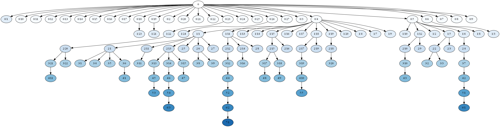

# Building Depth Colored Trees

> Build a depth colored tree from dict of dicts to easily visualize hierarchical structures


## Setting up


```python
import matplotlib
import numpy as np
```

Load Colormap


```python
import matplotlib.cm
cmap = matplotlib.cm.get_cmap('Blues')
```

Space colors equally (Note: color perception is not linear, so another spacing for equal perception might be more appropriate)


```python
max_val = 10
colors = [cmap(val)[:3] for val in np.linspace(0,1,max_val)]
hex_colors = [matplotlib.colors.rgb2hex(color) for color in colors]
```

Ensure text readability


```python
def get_text_color(color, cutoff=0.4, black="#000000", white="#FFFFFF"):
    """ switch from black to white text if background becomes too dark """
    if np.mean(color) < cutoff:
        return white
    return black
```

Test conversion


```python
text_color = [get_text_color(color) for color in colors]
print(hex_colors)
print(text_color)
```

    ['#f7fbff', '#e1edf8', '#ccdff1', '#abd0e6', '#82bbdb', '#58a1cf', '#3787c0', '#1b69af', '#084d96', '#08306b']
    ['#000000', '#000000', '#000000', '#000000', '#000000', '#000000', '#000000', '#000000', '#FFFFFF', '#FFFFFF']
    

## Creating the Graph


```python
def draw(node_parent, child_name, size, level):
    """
    Draws edge and node of child
    
    :param node_parent: node from which the child descends and from which a directed edge is drawn
    :type node_parent: Node
    :param child_name: name to write into child node
    :type child_name: String
    :param size: scale the node to this size
    :type size: Int
    :param level: defines the level the child node is on
    :type level: Int
    """
    node_child = pydot.Node(child_name, **style, fillcolor=hex_colors[level], fontcolor=text_color[level])#, width=size)
    graph.add_node(node_child)
    edge = pydot.Edge(node_parent, node_child)
    graph.add_edge(edge)
    return node_child
```


```python
def visit(node_dict, node_parent=None, level=0, add_origin_node=False):
    """
    recursively build graph
    
    :param node_dict: dictionary of dictionaries that are the children of this node
    :type node_dict: Dict or None
    :param node_parent: node that this dictionary descents from
    :type node_parent: Node
    :param level: current level of the graph
    :type level: Int
    :param add_origin_node: creates a node from which the first level leaves off from if True
    :type add_origin_node: Bool
    """
    for k,v in node_dict.items():
        if node_parent:
            this_node = draw(node_parent, k, max(len(v.keys())*1.2,1), level)
        else:
            this_node = pydot.Node(k, **style, fillcolor=hex_colors[level], fontcolor=text_color[level])
            graph.add_node(this_node)
        if isinstance(v, dict):
            if not node_parent and add_origin_node:
                node_parent = pydot.Node(0)#, fillcolor=colors[level])#, width=len(v.keys())+1)
                graph.add_node(node_parent)
                draw(node_parent, k, 1, 1)                
            visit(v, this_node, level+1)
            #if level==0:  node_parent = None
        else:
            draw(node_parent, k)
            # drawing the label using a distinct name
            #draw(k, k+'_'+v)
    return
```

## Sample Dictionary of variable depths


```python
hierarchy = {'0/1': {},
 '0/10': {},
 '0/11': {},
 '0/12': {},
 '0/13': {},
 '0/14': {},
 '0/15': {},
 '0/16': {},
 '0/17': {},
 '0/18': {'1/23': {}},
 '0/19': {'1/21': {}},
 '0/2': {},
 '0/20': {},
 '0/21': {},
 '0/22': {},
 '0/23': {'1/22': {'2/20': {'3/21': {'4/11': {}}, '3/22': {}}}},
 '0/24': {},
 '0/25': {},
 '0/26': {'1/24': {}},
 '0/27': {},
 '0/3': {},
 '0/4': {'1/1': {'2/1': {'3/1': {}, '3/4': {}, '3/5': {}, '3/6': {'4/1': {}}},
                 '2/11': {'3/11': {}},
                 '2/13': {'3/13': {'4/5': {'5/3': {}}},
                          '3/14': {'4/6': {'5/4': {'6/3': {}}}},
                          '3/15': {'4/7': {}}},
                 '2/5': {},
                 '2/6': {'3/8': {}, '3/9': {}},
                 '2/7': {}},
         '1/11': {'2/12': {'3/12': {'4/4': {'5/2': {'6/2': {'7/1': {}}}}}},
                  '2/14': {'3/16': {}},
                  '2/8': {}},
         '1/13': {},
         '1/14': {},
         '1/15': {'2/15': {'3/17': {'4/8': {}}, '3/18': {'4/9': {}}},
                  '2/16': {}},
         '1/16': {},
         '1/17': {},
         '1/18': {'2/17': {'3/19': {'4/10': {'5/5': {}}}}, '2/19': {}},
         '1/19': {'2/18': {'3/20': {}}},
         '1/20': {},
         '1/4': {},
         '1/7': {},
         '1/9': {}},
 '0/5': {'1/10': {},
         '1/12': {'2/10': {'3/10': {'4/3': {}}}, '2/9': {}},
         '1/2': {},
         '1/5': {'2/2': {'3/2': {}, '3/3': {}}, '2/3': {}},
         '1/6': {'2/4': {'3/7': {'4/2': {'5/1': {'6/1': {}}}}}},
         '1/8': {}},
 '0/6': {'1/3': {}},
 '0/7': {},
 '0/8': {},
 '0/9': {}}
```

## Styling


```python
from IPython.display import Image
```

Defining shape: here we want them filled in the appropriate color


```python
style = {
    'style':'filled',
    #'shape':'rounded'
}
```

## Visualizing


```python
import pydot
```

Visualizing them in horizontal order with an origin node


```python
graph = pydot.Dot(graph_type='digraph')
visit(hierarchy, add_origin_node=True)
graph.write_png('linear.png')
Image('./linear.png')
```





Allowing denser packing allows for some more readable format, although not as clear for which the color shading helps.


```python
graph = pydot.Dot(graph_type='digraph', pack='true', overlap_shrink='true')
style = {
    'style':'filled',
    #'shape':'rounded'
}
visit(hierarchy)
graph.write_png('shrinked.png')
Image('./shrinked.png')
```


Saving the graph as a svg allows for importing into PowerPoint. Once imported, a right-click convert to shapes allows to have them in native PowerPoint shapes.


```python
graph.write_svg('graph.svg')
```

# Importing Graph into PowerPoint

Step 1: Drag & Drop SVG onto slide

Step 2: Conert to Shape


Step 3: Convert to drawing object


Step 4: Resulting Representation


Note: Current problems in SVG to PowerPoint conversion (Feb. 2020, Office 365)

- Labeling disappears
- Arrows are images of lines + image of head
- Arrows are not connected to bullets


